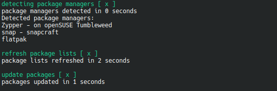

# Update-Linux
Tool to quickly update your linux system.



```
python3 main.py
```
```
update-linux
```

## Usage
1. Download the "main.py" script, the .deb Version or the .rpm Version.
2. Install the Package if you used .deb or .rpm .
4. Run "sudo python3 main.py" or "sudo update-linux" (you need to run the program as superuser)

## Install RPM Package
1. Download the latest .rpm file (or build it) from GitHub Releases
2. Install it via Package manager (DNF, Zypper ...)
3. Use it with "sudo update-linux" instead of "python main.py"  
(You can remove the package with your package manager and the package name "update-linux")

## Install DEB Package
1. Download the latest .deb file (or build it) from GitHub Releases
2. Install it via Package manager (APT)
3. Use it with "sudo update-linux" instead of "python main.py"  
(You can remove the package with your package manager and the package name "update-linux")

-----------------

## Build the .rpm package yourself
(On openSUSE Tumbleweed)
1. Install Tools "sudo zypper install rpmbuild python3-setuptools python3-devel"
2. Clone Repository "git clone https://github.com/DasIstTobias/Update-Linux.git"
3. Move in repository "cd Update-Linux"
4. Create Build directory "mkdir -p ~/rpmbuild/{SOURCES,SPECS,BUILD,RPMS,SRPMS}"
5. Create Source "python setup.py sdist --formats=gztar"
6. Copy Source to Build directory "cp dist/update_linux-*.tar.gz ~/rpmbuild/SOURCES/"
7. Create .spec File "nano ~/rpmbuild/SPECS/update-linux.spec". Example File:
   ```lyrics-search.spec
   %define version 1.0
   %define release 1

   Name:           update-linux
   Version:        %{version}
   Release:        %{release}%{?dist}
   Summary:        Tool to quickly update your linux system

   License:        GPLv3
   URL:            https://github.com/DasIstTobias/Update-Linux
   Source0:        update_linux-1.0.tar.gz

   BuildRequires:  python3-devel
   BuildRequires:  python3-setuptools

   Requires:       python3 >= 3.11

   BuildArch:      noarch

   %description
   Tool to quickly update your linux system

   %prep
   %autosetup -n update_linux-1.0

   %build
   %py3_build

   %install
   %py3_install

   %files
   %license LICENSE
   %doc README.md
   %{_bindir}/update-linux
   %{python3_sitelib}/update_linux/
   %{python3_sitelib}/update_linux-%{version}-py*.egg-info

   %changelog
   * $(LANG=C date "+%a %b %d %Y") DasIstTobias placeholder@example.com - %{version}-%{release}
   - Update to version %{version}

   * Sun May 06 2025 tobias@randombytes placeholder@example.com - 0.1.0-1
   - Initial RPM package build.
   ```
8. Build the .rpm File "rpmbuild -ba ~/rpmbuild/SPECS/update-linux.spec"
9. The RPM File is saved in "~/rpmbuild/RPMS/noarch/"

## Build the .deb package yourself
(In Docker)
1. Install Docker
2. Clone Repository "git clone https://github.com/DasIstTobias/Update-Linux.git"
3. Move in repository "cd Update-Linux"
4. Create a Dockerfile "nano Dockerfile" Example File:
   ```
   FROM debian:bookworm-slim

   ENV DEBIAN_FRONTEND=noninteractive

   RUN apt-get update && \
       apt-get install -y --no-install-recommends \
       python3 \
       python3-pip \
       python3-setuptools \
       python3-stdeb \
       python3-all \
       build-essential \
       dh-python \
       git \
       fakeroot \
       dh-make \
       devscripts \
       && rm -rf /var/lib/apt/lists/*

   RUN python3 -m pip install --upgrade pip setuptools --break-system-packages

   WORKDIR /build

   ADD . /build/Update-Linux
   WORKDIR /build/Update-Linux

   RUN python3 setup.py --command-packages=stdeb.command bdist_deb
   ```
5. Build the .deb File "sudo docker build -t update-linux-deb-builder ."
6. Create the Docker container "sudo docker create --name temp-builder update-linux-deb-builder"
7. Copy the .deb file out of the Docker container into your current directory "sudo docker cp temp-builder:/build/Update-Linux/deb_dist/python3-update-linux_1.0-1_all.deb ."
8. Delete the Docker Container "sudo docker rm temp-builder"
